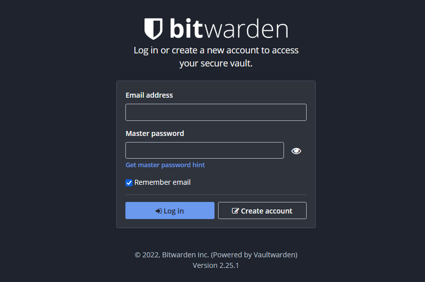

# Vaultwarden on Amazon ECS and AWS Fargate

Deploy your own self-hosted deployment of [Vaultwarden][vaultwarden] on AWS.



### What is [VaultWarden]?

From the project page:

> Alternative implementation of the Bitwarden server API written in Rust and compatible with upstream Bitwarden clients, perfect for self-hosted deployment where running the official resource-heavy service might not be ideal.

### What is _this_ project?

This is an [Infrastructure-as-Code (IaC)][iac] codebase using the
[AWS Cloud Development Kit (CDK)][awscdk] that deploys a pre-configured, pre-architected
application system that runs Vaultwarden on your own AWS account. Using this project,
you can deploy everything you need to run a self-hosted Vaultwarden system quickly,
without having to manually create and deploy the system's different pieces one by one.

This project aims to:

1. Make it relatively simple to deploy your own self-hosted Vaultwarden instance,
2. While keeping it as low cost as possible,
3. While _also_ keeping the deployment as secure, resilient, and reliable as possible.

While Vaultwarden is amazingly simple to run on something like Raspberry Pi or your own
hardware, it is still terribly complex to ensure that your data survives unexpected
disasters of any severity. (Consider: what would you have to do if your own hardware fails?)

We believe the best compromise is a sort of middle ground, wherein your data resides
in the cloud, in an environment you control, with as many security and reliability
considerations as it is practical to ensure your data is safe and private only to you.

> **TODO** Architectural considerations --- what are you exactly deploying with this?

---

## Requirements

- AWS credentials configured on your shell (normally using the [AWS CLI][awscli] --- [see here][creds-config])
- Node.js (this was created on `v16.x`, but should work with `v14.x` and perhaps `v12.x`)
  - this project also prefers [`yarn`][yarn], but you can use `npm` with a few minor tweaks.

To check if you have your AWS credentials correctly configured, run the following command
in your terminal and verify that the information provided is as you expect.

```shell
aws sts get-caller-identity
```

## Usage

Once you've cloned this repository to your local machine:

1. Install dependencies with:

   ```shell
   yarn install
   ```

2. Create a file called `.env` on the project root (you can just duplicate the `.env.sample` provided). You'll need to provide _at least_ the target version of Vaultwarden you intend to run.

   You can check [Docker Hub][docker-hub] for available versions.
   At the time of this project's creation, the latest was `1.24.0`.

3. If you haven't used the AWS CDK before on your AWS account, you will need to run
   the bootstrapping process once:

   ```shell
   yarn cdk bootstrap
   ```

4. Then you're ready to deploy!

   ```shell
   yarn cdk deploy
   ```

   The deployment process will ask confirmation on a few items (specifically, security-based
   concerns). Provide your confirmation when prompted.

Once everything has been deployed, you will be given a few (redundant) outputs ---
these are the URLs of the load balancer that will give you access to your Vaultwarden deployment.

```text
✅  vaultwarden-stack

✨  Deployment time: 77.33s

Outputs:
vaultwarden-stack.vaultwardenserviceLoadBalancerDNS37D49D0D = vault-vault-ABCDEFGHIJKLM-1234567890.ap-southeast-1.elb.amazonaws.com
vaultwarden-stack.vaultwardenserviceServiceURLDB2F58BA = https://vault-vault-ABCDEFGHIJKLM-1234567890.ap-southeast-1.elb.amazonaws.com
vaultwarden-stack.vaultwardenserviceloadbalancerdnsnameE514D7A5 = vault-vault-ABCDEFGHIJKLM-1234567890.ap-southeast-1.elb.amazonaws.com

Stack ARN:
arn:aws:cloudformation:ap-southeast-1:12345678901234:stack/vaultwarden-stack/4ef1cf10-cbb2-11ec-8063-0afd3d2645ba

✨  Total time: 81.9s
```

You should be good to go!

### Updating the deployment

If you need to change anything in the stack (e.g. you want to update Vaultwarden to a
more current version), then just run `yarn cdk deploy` again after making the
necessary changes.

The deployment process will automatically determine what exactly needs to be deployed,
and make the necessary adjustments.

## Configuring Vaultwarden

The default settings that Vaultwarden runs in is sufficient for most general use, but
if you want to customize some of its behavior, you can also do so.

The Vaultwarden container image can be configured by passing in specific environment
variables into it ([more info here][vaultwarden-envvars]). If you wish to explicitly
set some of these config env vars:

1. Determine which environment variable/s you want to set (e.g. `SENDS_ALLOWED=true`),
2. Append `VAULTWARDEN_CONFIG_` to the variable name (e.g. `VAULTWARDEN_CONFIG_SENDS_ALLOWED=true`),
3. Finally, add the key-value pair to your `.env` file, and update your deployment.

For safety reasons, the deployment will only consider environment variables that are
prefixed by `VAULTWARDEN_CONFIG_` for embedding in the container. **Note that there is no
cross-checking done to ensure that configuration items you provide are valid.**

[Refer to this document for a list of available environment variables you can set][vaultwarden-envvar-list].

### Enabling the admin page

Most likely, the easiest way to manage your deployment's configuration is through
the adminstration page (disabled by default). For most configuration values, you can
set them directly on the administration page once it's been enabled, so you don't have
to keep them in environment variables.

To enable the admin page, add the corresponding env var to `.env`, then update your
deployment:

```dotenv
VAULTWARDEN_CONFIG_ADMIN_TOKEN=[some very long random string of your choice]
```

[More information about the admin page here][vaultwarden-admin-page].

---

## Advanced configuration

### Enabling HTTPS

By default, your deployment will be served via plain HTTP only.
It is strongly recommended that you enable HTTPS for greater security.
This is a password manager after all!

To enable HTTPS, you will need to provide a domain name in your `.env` file.

```dotenv
VAULTWARDEN_BASE_VERSION=1.24.0
VAULTWARDEN_DOMAIN_NAME=vault.example.com
```

If you do this and run `yarn cdk deploy`, the deployment will do the following adjustments:

- request an SSL certificate from AWS Certificate Manager, tied to the domain you provided,
- trigger the verification process for that certificate,
- attach the certificate to your deployment's load balancer, and
- enforce HTTPS on your load balancer.

Note that the certificate's verification process **requires manual effort on your part**,
and the deployment **will pause until the certificate has been successfully verified** before
it continues.

To complete verification, you will need to add DNS records to your domain's registrar.
[You can view the steps and the DNS records to add here][verification], during deployment.

Your domain registrar will have specific instructions on how to add the required
DNS records. Please consult your registrar's documentation on how to complete this step.

### Using a custom domain

You can use your own domain (e.g. `vault.example.com`) by adding a **CNAME** DNS record
in your domain's registrar that points to the DNS name of the load balancer above.

This works with or without HTTPS (but, again, enabling HTTPS is strongly recommended).

---

[Website][website] &middot; [@techlifemusic][twitter]

[vaultwarden]: https://github.com/dani-garcia/vaultwarden
[iac]: https://docs.aws.amazon.com/whitepapers/latest/introduction-devops-aws/infrastructure-as-code.html
[awscdk]: https://aws.amazon.com/cdk
[awscli]: https://aws.amazon.com/cli
[creds-config]: https://docs.aws.amazon.com/cli/latest/userguide/cli-chap-configure.html
[yarn]: https://classic.yarnpkg.com/lang/en/
[docker-hub]: https://hub.docker.com/r/vaultwarden/server/tags
[verification]: https://console.aws.amazon.com/acm/home#/certificates/list
[website]: https://richardneililagan.com
[twitter]: https://twitter.com/techlifemusic
[vaultwarden-envvars]: https://github.com/dani-garcia/vaultwarden/wiki/Configuration-overview
[vaultwarden-envvar-list]: https://github.com/dani-garcia/vaultwarden/blob/main/.env.template
[vaultwarden-admin-page]: https://github.com/dani-garcia/vaultwarden/wiki/Enabling-admin-page
